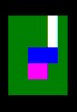

# Map Files

A map file describes the Kingdom of Frupal's condition at the start of a game.  
This includes the size of the Kingdom, the terrain (meadows, marshes, waterways 
and walls) at every grovnik, and descriptions of every item found in the Kingdom.

### Filename convention
Map files may have any filename, but typically will end with the ".fmap" suffix.

## Structure
* Every element in the map file begins with the name of the element type at the start of a line, followed by a colon.  
* Element names must not contain whitespace.
* The first line of the file must be the `Frupal_Kingdom:` element.  
* Parameters describing the element follow the colon and are separated by white space.  
* All elements, except for `terrain:` are contained on a single line in the map file.  
* Empty lines are ignored.  
* Lines beginning with `#` are ignored. This may be used to include comments in a map file.  
* X,Y locations are zero indexed. The `0 0` origin is at the top left (northwest) corner of the map.

The following elements are required for a complete game map: [`Frupal_Kingdom`](#frupal_kingdom), [`terrain:`](#terrain), [`start:`](#start), [`diamonds:`](#diamonds).

The following elements are optional, but are suggested for a more interesting game experience: [`ship:`](#ship), [`binoculars:`](#binoculars), [`food:`](#food), [`clue:`](#clues), [`treasure:`](#treasure), [`obstacle:`](#obstacles), [`tool:`](#tools)

## Elements

### Frupal_kingdom

Frupal_Kindgom:

Declares that the file contains a map description for the Kingdom of Frupal game.  
This element **MUST** be specified on the very first line of the map file.  
This element has no parameters.  
This may only be specified **once**.  

Example: `Frupal_Kingdom:`

---
### Terrain

terrain: *<x dimension\>* *<y dimension\>*  
*<first row of terrain characters\>*  
*<second row of terrain characters\>*  
*...*  
*<last row of terrain characters\>*  

Defines the dimensions of and the kind of terrain grovnik at every location on the map.
The only element allowed before `terrain:` in the map file is `Frupal_Kingdom:`.
Each row of terrain characters **must** have the same number of characters as *<x dimension\>*.  
There **must** be as many rows of terrain characters as *<y dimension\>*.  
**No** blank lines or comment lines are allowed between `terrain:` and the last row of terrain characters.  
This may only be specified **once**.  
The supported terrain characters are:

* `.` (period) - Meadow
* `=` (equals) - Wall
* `"` (double quote) - Swamp
* `~` (tilde) - Water

6x5 Example:

    terrain: 6 5
    ....=.  
    ....=.
    ..~~~.
    ..""..
    ......

As rendered in game:

---
### Start

start: *<x location\>* *<y location\>*

Specifies the starting location of the Hero.  
This may only be specified **once**.  
The following example places the Hero just inside of the northwest corner of the map.

Example: `start: 1 1`

---
### Diamonds

diamonds: *<x location\>* *<y location\>*

Specifies the location of the Royal Diamonds.  
This may only be specified **once**.  
The following example places the diamonds in the northeast region of a 128x128 map:

Example: `diamonds: 100 24`

---
### Treasure

treasure: *<x location\>* *<y location\>* *<value\>* *<description\>*

Specifies one of many treasure items on the map, including location, value in whiffles to be added to the player's bank account, and a name.  
The following example places a gold bar worth 4000 whiffles in the southwest region of a 128x128 map:  

Example: `treasure: 10 127 4000 A medium sized gold bar.`

---
### Food

food: *<x location\>* *<y location\>* *<cost\>* *<energy\>* *<description\>*

Specifies one of many food items on a map.  
*<cost\>* is the price in whiffles to purchase this food item.  
*<energy\>* is the number units of energy buying and eating this food will give to the player.  
The following example places a hotdog worth 10 energy, costing 2 whiffles near the center of a 128x128 map:  

Example: `food: 60 77 2 10 Hotdog with relish and mustard.`

---
### Clues

clue: *<x location\>* *<y location\>* *<text\>*

Specifies one of many clue items on a map.  
*<text\>* Is the information shown to the player when they discover this clue.  
Clues are either 100% correct, or 100% false.  
Clues typically make several claims at once, which allows the player to determine whether the whole clue is true or not.  
The following example places a clue about the location of some treasure one grovnik to the east from the northwest corner of the map:  

Example: `clue: 1 0 You are 10 grovniks west of water. There is a treasure 40 grovniks south and 3 grovniks east of here.`

---
### Ship

ship: *<x location\>* *<y location\>* *<cost\>*

Specifies the location of the Ship on the map, which allows a player to travel on water grovniks.  
This may only be specified **once**.  
*<cost\>* is the price in whiffles to purchase the ship.  
The following example places the Ship, with a purchase price of 10000 whiffles, along the eastern edge of a 128x128 map:  

Example: `ship: 128 64 10000`

---
### Binoculars

binoculars: *<x location\>* *<y location\>* *<cost\>*

Specifies the location of the Binoculars on the map.  
The Binoculars allow a player to see two grovniks around themselves, instead of one.  
This may only be specified **once**.  
*<cost\>* is the price in whiffles to purchase the Binoculars.  
The following example places the Binoculars, which cost 500 whiffles to purchase, along the southern edge of a 128x128 map:  

Example: `binoculars: 70 128 500`

---
### Obstacles

obstacle: *<x location\>* *<y location\>* *<kind\>* *<energy cost\>* *<description\>*

Specifies one of many obstacles on a map, which cost energy to remove.  
*<kind\>* is a string that defines what type of obstacle this is, and thus what tools affect this obstacle. (Should match a tool's *<target\>*)
*<kind\>* may not contain whitespace, and is not visible to the player.  
*<energy cost\>* is the amount of energy required for a player to remove this obstacle without the appropriate tool.  
*<description\>* Should be used for the player-visible description of an obstacle instead of *<kind\>*.  
The following example places a boulder requiring 15 energy to remove on the western edge of a 128x128 map:  

Example: `obstacle: 0 44 boulder 15 Someone or something has driven a pillar of granite into the ground here, blocking your path.`

---
### Tools

tool: *<x location\>* *<y location\>* *<target\>* *<divisor\>* *<cost\>* *<description\>*

Specifies one of many tools on a map, which can lower the energy cost of removing obstacles.
*<target\>* is a string that defines what type of obstacle this tool helps to remove. (Should match an obstacle's *<kind\>*)  
*<target\>* may not contain whitespace, and is not visible to the player.  
*<divisor\>* is a number that will be used to divide the energy cost of an obstacle.  
A tool with a divisor of `3` would make the obstacle it removes cost only 1/3 as much energy to remove.  
*<cost\>* is the price in whiffles to purchase this tool.  
The following example places a hammer, costing 100 grovnicks, with divisor 2, that affects boulders, along the northern edge of a 128x128 map:  

Example: `tool: 61 0 boulder 2 100 Rock smashing hammer X2`
